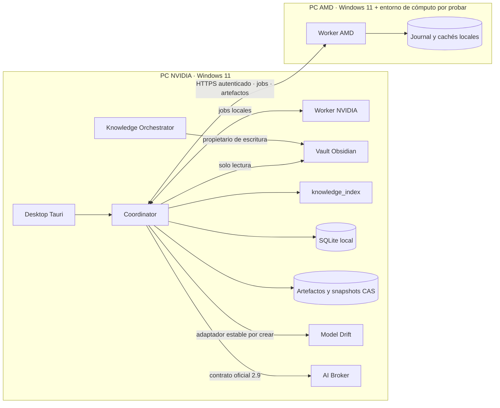
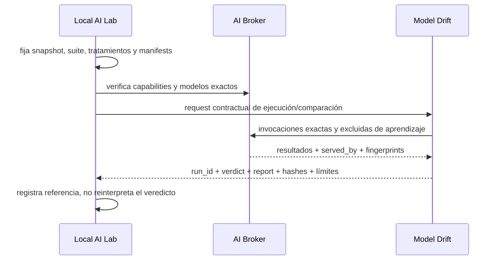

# Local AI Lab — Diseño de Fase A

**Estado:** propuesta arquitectónica pendiente de aprobación humana  
**Fecha de revisión:** 23 de agosto de 2026  
**Alcance:** Fase A exclusivamente; no se ha creado todavía código de producto  
**Veredicto:** **APTO PARA DECISIÓN, NO APTO TODAVÍA PARA INICIAR LA FASE 0**

El diseño es viable con la topología propuesta, pero no debe cruzar a la Fase 0 hasta
resolver las decisiones enumeradas al final. Hay tres dependencias que no se pueden dar por
cerradas: el código `vaulttrain` no está localizado, Model Drift carece hoy de un contrato
machine-readable estable para ser invocado por otra aplicación sin leer su SQLite y el nodo
AMD no ha sido inspeccionado ni probado.

**Restricción operativa añadida por el usuario:** la instalación y el repositorio de AI
Broker presentes en este PC son estrictamente de solo lectura para Local AI Lab. Su versión
desplegada no se presume actual. Local AI Lab nunca actualizará, migrará, reconfigurará ni
escribirá datos de AI Broker; si una fase requiere una capacidad ausente, se detendrá y
solicitará al usuario que instale la versión necesaria.

---

## 1. Decisión ejecutiva

Local AI Lab será un único producto local-first y distribuido, con un único repositorio y un
único modelo de dominio. El mismo paquete podrá ejecutar los roles `desktop`, `coordinator`
y `worker`, solos o combinados.

La primera topología será:



Las decisiones arquitectónicas recomendadas son:

1. **Coordinator autoritativo único.** Posee el estado de Local AI Lab y su SQLite local.
2. **Workers no autoritativos.** Poseen un journal local, cachés, checkpoints y resultados
   pendientes de sincronización.
3. **Protocolo por API, nunca por fichero de base de datos compartido.** SQLite documenta
   riesgos de sincronización y bloqueo sobre sistemas de archivos de red; la base se abre
   únicamente desde procesos de su máquina anfitriona ([SQLite over a network](https://www.sqlite.org/useovernet.html)).
4. **Asignación por capacidades medidas.** Ningún trabajo se liga a `AMD` o `NVIDIA` en el
   código de dominio.
5. **Vault de solo lectura y snapshot inmutable.** El nodo AMD no monta Obsidian por SMB.
6. **AI Broker sigue siendo el gateway de modelos.** Local AI Lab no crea un router general.
7. **Model Drift sigue siendo el dueño de la comparación formal.** Local AI Lab prepara la
   suite y conserva la referencia al resultado; no reimplementa sus estadísticas.
8. **Athena no se duplica.** Solo se integrará en una fase posterior si un experimento exige
   su runtime autónomo verificable.

---

## 2. Alcance y no objetivos

### 2.1 Objetivo del producto

Determinar experimentalmente qué estrategia satisface los criterios de calidad con menor
complejidad, coste, latencia y pérdida de privacidad para una tarea sobre conocimiento
privado.

La unidad comparada no será «un modelo» aislado, sino un **tratamiento versionado**:

```text
tratamiento = estrategia + modelo(s) + prompt + retrieval + snapshot + parámetros + política
```

### 2.2 No objetivos

Local AI Lab no será:

- otro AI Broker;
- otro runtime autónomo general;
- otro Model Drift;
- un editor o publicador de Obsidian;
- una copia de la persistencia de Knowledge Orchestrator;
- un producto cuyo éxito se mida por haber completado un fine-tuning;
- dos aplicaciones distintas según la GPU;
- un sistema de puntuación única que esconda trade-offs.

### 2.3 Invariantes

- `knowledge corpus != training examples != evaluation set`.
- El vault es fuente externa y se trata como `local_only`.
- Ningún contenido privado sale a cloud sin política explícita y confirmación humana.
- Precio desconocido no se registra como cero.
- Una capacidad puede estar `declared`, `detected`, `tested` o `benchmarked`; esos estados no
  se colapsan.
- Una afirmación factual sin evidencia recuperable pasa a `uncertainties` o
  `missing_information`.
- No existe «exactly once» distribuido: se diseña para reintentos idempotentes, fencing y
  reconciliación.

---

## 3. Reconocimiento del ecosistema existente

### 3.1 Evidencia inspeccionada

| Componente | Código/documentación inspeccionada | Estado observado |
| --- | --- | --- |
| AI Broker | `README.md`, `docs/Client_API.md`, `app/main.py`, `app/schemas.py`, pruebas contractuales | API HTTP 2.9 implementada; worktree con cambios no confirmados |
| Knowledge Orchestrator | `README.md`, `docs/CURRENT_STATE.md`, contratos y pruebas | Ingesta, workflow, claims, revisión y publicación pertenecen a este producto |
| Model Drift | `docs/ARCHITECTURE.md`, `docs/BROKER_COMPATIBILITY.md`, CLI, runner y pruebas | CLI/API Python implementadas; falta un bridge estable para automatización externa |
| Athena | `README.md`, `docs/CURRENT_STATE.md`, contrato de tools y pruebas | Runtime autónomo verificable separado; no debe incorporarse al control plane |
| Obsidian | Registro local de vaults y metadatos de carpetas accesibles | Hay varios vaults registrados; el vault de producción debe identificarse explícitamente |
| vaulttrain | búsqueda por nombre y capacidades descritas en `D:\Desarrollo` | No localizado; no auditado y no probado |

### 3.2 AI Broker: frontera real

El Broker expone actualmente, entre otros:

- `POST /api/v1/tasks` con idempotencia;
- `GET /api/v1/tasks/{task_id}`;
- `GET /api/v1/tasks/{task_id}/invocations`;
- `GET /api/v1/groups/{group}`;
- `DELETE /api/v1/tasks/{task_id}`;
- `GET /api/v1/models` y endpoints de disponibilidad/contexto;
- `GET /api/v1/capabilities`;
- `GET /health`, `/health/live` y `/health/ready`.

El contrato 2.9 observado anuncia selección exacta de modelo, determinismo de generación,
`exclude_from_model_learning`, telemetría de invocaciones y huella de ejecución. También
soporta `single`, `mixture_of_agents`, `agent` y, si está habilitado, `auto`.

Esta observación procede del código disponible en disco y **no demuestra** que el servicio
desplegado en esta máquina ejecute esa misma revisión. Repositorio inspeccionado y servicio
en ejecución se tratarán como dos identidades distintas.

**Diseño de integración:**

- `BrokerAdapter` negocia `/capabilities` al arrancar y periódicamente.
- Registra por separado versión contractual observada, capabilities efectivas, health,
  fingerprint del despliegue cuando el contrato lo permita y fecha de observación.
- Una estrategia declara capacidades requeridas; si faltan, queda `UNAVAILABLE`, no hace
  fallback silencioso.
- Los benchmarks fijan `target_model`, `fallback_allowed: false`,
  `exclude_from_model_learning: true` y solicitan huella de ejecución.
- Todo tráfico de vault usa `risk.data_classification: local_only`.
- La copia de schemas del Broker queda encapsulada en el adaptador hasta que exista un
  paquete compartido oficial.
- Las respuestas aceptan extensiones aditivas, pero rechazan la ausencia de campos
  críticos para reproducibilidad.
- Local AI Lab no lee `broker.db`, no interpreta configuración interna y no decide el
  proveedor fuera del contrato solicitado.
- Local AI Lab no escribe en el repositorio, configuración, entorno virtual, base de datos,
  logs o directorios de datos de AI Broker.
- Las comprobaciones futuras serán lecturas o tareas creadas exclusivamente mediante la API
  pública y solo cuando la fase las autorice. No se ejecutarán tests que creen temporales
  dentro del repositorio de AI Broker.

#### Puerta de compatibilidad por fase

Antes de cada fase que use AI Broker se construirá un `BrokerRequirementSet` con las
capacidades mínimas. El adaptador compara los requisitos con `/capabilities`:

```text
SATISFIED   -> la fase puede continuar con la versión observada
DEGRADED    -> solo continúa si la limitación está documentada y aprobada
UNSATISFIED -> se detiene; se informa al usuario de versión/capacidad requerida
UNKNOWN     -> se detiene; ausencia de evidencia no equivale a compatibilidad
```

El aviso al usuario indicará exactamente la fase, endpoint o capacidad ausente, contrato
mínimo conocido, motivo, prueba posterior de compatibilidad y posible impacto sobre otras
aplicaciones. Local AI Lab nunca realiza la actualización por sí mismo.

### 3.3 Knowledge Orchestrator: frontera real

Knowledge Orchestrator es el propietario de la creación, revisión, modificación y
publicación de conocimiento. Local AI Lab solo leerá el vault mediante
`ReadOnlyVaultAdapter`.

No se reutilizarán:

- su SQLite;
- sus repositorios internos;
- su lógica de publicación;
- su modelo de claims como dependencia implícita.

Si en el futuro hacen falta `manual_lock`, procedencia interna o estado de publicación, se
añadirá una API explícita al Orchestrator y un adaptador versionado en Local AI Lab.

### 3.4 Model Drift: frontera real y hueco contractual

Model Drift posee suites, fixtures, oráculos, repeticiones, comparación pareada,
metamórficas, juez, McNemar, bootstrap, Benjamini-Hochberg, SESOI, potencia e informes.

La CLI actual ofrece `modelos`, `ejecutar`, `comparar`, `tiradas` y `potencia`, pero su salida
principal es humana y las comparaciones almacenadas se resuelven en su propia SQLite. Por
ello, Local AI Lab **no puede automatizar de forma robusta la integración actual sin
acoplamiento interno**.

Se recomienda añadir en el proyecto Model Drift, antes de la Fase 8, uno de estos contratos:

1. **Recomendado:** bridge CLI por ficheros JSON versionados.
2. Alternativa: API HTTP local versionada.

Contrato conceptual recomendado:

```text
model-drift contract run --request request.v1.json --response response.v1.json
model-drift contract compare --request compare.v1.json --response verdict.v1.json
```

La respuesta mínima debe incluir `contract_version`, `run_id`, `status`, `manifest_hash`,
`report_uri`, `report_sha256`, `verdict`, `limitations` y `error`. Local AI Lab conserva esos
campos y el artefacto exportado; nunca consulta las tablas internas.

### 3.5 Athena

Athena seguirá siendo un servicio externo opcional. A1 no significa construir un loop de
agente en Local AI Lab: se medirá primero `AI Broker agent`; solo si la hipótesis requiere
autonomía verificable de Athena se crea `AthenaAdapter` sobre su servicio wire v1.

### 3.6 vaulttrain

No se encontró el repositorio o paquete. La reutilización queda bloqueada. Cuando se aporte
la ruta se ejecutará este protocolo antes de adoptar código:

1. inventario y licencia;
2. ejecución de su suite sin modificar dependencias;
3. mapa de parsing, IDs, incrementalidad, soft delete y esquema;
4. tests de frontmatter, wikilinks, embeds, exclusiones y estabilidad de IDs;
5. análisis de qué conceptos pertenecen a `knowledge_index`;
6. decisión `reuse`, `adapt` o `replace` por componente;
7. registro de procedencia de todo código adaptado.

No se copiará código basándose solo en la descripción del briefing.

---

## 4. Arquitectura lógica

### 4.1 Capas

```text
Desktop (React/TypeScript)
        │ comandos y vistas tipadas
Tauri shell (Rust, permisos mínimos)
        │ inicia/descubre sidecar local o conecta al Coordinator remoto
Application API (Python/FastAPI)
        │
        ├── Experiment Service
        ├── Benchmark Service
        ├── Strategy Registry
        ├── Retrieval Service
        ├── Dataset Factory
        ├── Human Review Service
        ├── Node/Job Scheduler
        ├── Artifact/Manifest Service
        └── Audit/Policy Service
                │
Domain model (sin HTTP, SQLite, Tauri ni proveedores)
                │
Ports
  ├── CoordinatorRepository
  ├── WorkerJournal
  ├── ArtifactStore
  ├── VaultReader
  ├── KnowledgeIndex
  ├── ModelGateway
  ├── FormalEvaluator
  └── AutonomousRuntime (futuro)
                │
Adapters
  ├── SQLite local
  ├── filesystem CAS
  ├── ReadOnlyVaultAdapter
  ├── AI Broker 2.9
  ├── Model Drift contract v1 (pendiente)
  └── Athena service v1 (futuro)
```

### 4.2 Monorepo propuesto para la Fase 1

```text
Local AI Lab/
├── apps/
│   └── desktop/                 # Tauri 2 + React + TypeScript
├── services/
│   ├── coordinator/             # API y control plane Python
│   └── worker/                  # runtime de jobs Python
├── packages/
│   ├── domain/                  # modelo sin infraestructura
│   ├── contracts/               # JSON Schema/OpenAPI canónicos
│   ├── strategies/              # interfaz y baselines
│   ├── knowledge_index/         # proyección regenerable
│   └── observability/
├── adapters/
│   ├── ai_broker/
│   ├── model_drift/
│   ├── athena/
│   └── vault/
├── tests/
│   ├── contract/
│   ├── integration/
│   ├── fault_injection/
│   └── fixtures/
├── docs/
└── tools/
```

Los contratos se definen una vez como JSON Schema/OpenAPI y generan tipos Pydantic,
TypeScript y, donde sea necesario, Rust. No se mantienen tres modelos escritos a mano.

### 4.3 Desktop y sidecar

Tauri 2 puede empaquetar binarios externos como sidecars y restringir su ejecución con
capabilities ([sidecars](https://v2.tauri.app/develop/sidecar/),
[capabilities](https://v2.tauri.app/security/capabilities/)). La recomendación es:

- React nunca accede al vault, a SQLite ni a secretos;
- Tauri expone solo comandos allowlist de arranque, conexión y selección de rutas;
- el backend Python empaquetado actúa como sidecar;
- en modo local, Tauri obtiene un endpoint efímero autenticado del sidecar;
- en modo remoto, Tauri se conecta al Coordinator como un dispositivo emparejado;
- ninguna capability remota de Tauri se habilita por defecto.

---

## 5. Coordinator, workers y protocolo

### 5.1 Responsabilidades del Coordinator

- autoridad sobre proyectos, experimentos, datasets, feedback y decisiones;
- registro de nodos y capacidades históricas;
- creación de jobs y selección de worker;
- leases, fencing y reconciliación;
- políticas de privacidad y coste;
- snapshotting e índices del vault;
- manifiestos, artefactos y auditoría;
- invocación contractual de AI Broker y Model Drift.

### 5.2 Responsabilidades del Worker

- detectar y probar capacidades;
- reclamar trabajos compatibles;
- persistir el job antes de aceptarlo;
- continuar desconectado cuando la política del job lo permita;
- producir progreso, checkpoints y artefactos con hash;
- sincronizar resultados al reconectar;
- no decidir promociones, datasets aprobados ni verdad del proyecto.

### 5.3 `NodeCapabilities`

```json
{
  "schema_version": "1.0",
  "node_id": "uuidv7",
  "measurement_id": "uuidv7",
  "measured_at": "RFC3339 UTC",
  "facts": [
    {
      "key": "gpu.memory_bytes",
      "value": 17175674880,
      "status": "detected",
      "source": "nvidia-smi",
      "source_version": "610.88"
    }
  ],
  "workloads": [
    {
      "kind": "inference",
      "status": "benchmarked",
      "constraints": {"dtype": "fp16", "max_model_bytes": 0},
      "evidence_artifact_id": "uuidv7"
    }
  ]
}
```

Cada medición es inmutable. El «estado actual» es una vista de la última evidencia válida,
no una fila que destruye el historial.

### 5.4 Protocolo v1

Todos los workers inician conexiones salientes hacia el Coordinator. Endpoints conceptuales:

```text
POST /node/v1/pair
POST /node/v1/register
POST /node/v1/heartbeats
POST /node/v1/capability-reports
POST /node/v1/jobs/claim
POST /node/v1/jobs/{job_id}/ack
POST /node/v1/jobs/{job_id}/lease/renew
POST /node/v1/jobs/{job_id}/progress
POST /node/v1/jobs/{job_id}/checkpoint
POST /node/v1/jobs/{job_id}/complete
POST /node/v1/jobs/{job_id}/fail
GET  /node/v1/jobs/{job_id}/control
POST /node/v1/artifacts/init
PUT  /node/v1/artifacts/{artifact_id}/chunks/{index}
POST /node/v1/artifacts/{artifact_id}/commit
```

Reglas:

- versiones mínimas y máximas negociadas en registro;
- `Idempotency-Key` en toda mutación;
- `traceparent` W3C y `correlation_id` de dominio en todas las llamadas
  ([W3C Trace Context](https://www.w3.org/TR/trace-context/));
- reloj del Coordinator autoritativo para leases;
- `lease_token` con generación monotónica como fencing token;
- chunks de artefacto direccionados por SHA-256, reanudables y deduplicables;
- payloads pequeños; los binarios viajan por el protocolo de artefactos;
- errores tipados en esquema estable;
- límites de tamaño, frecuencia y concurrencia por nodo.

### 5.5 Estados de job

```text
DRAFT -> READY -> LEASED -> ACKNOWLEDGED -> RUNNING
                                          ├-> PAUSING -> PAUSED
                                          ├-> CANCELLING -> CANCELLED
                                          ├-> SUCCEEDED_PENDING_SYNC -> SUCCEEDED
                                          └-> FAILED_PENDING_SYNC -> FAILED

LEASED/RUNNING --lease vencido--> ORPHANED
ORPHANED --reconciliación--> RUNNING | SUPERSEDED | NEEDS_REVIEW
```

No se reasigna automáticamente un entrenamiento largo si el worker puede estar ejecutándolo
sin conexión. Cada tipo de job declara:

- `idempotency_class`: `pure`, `checkpointable`, `non_repeatable`;
- `disconnect_policy`: `stop`, `continue`, `checkpoint_then_stop`;
- `reassignment_policy`: `automatic`, `after_grace`, `human_only`.

Un resultado con fencing token obsoleto no sustituye el resultado vigente: se conserva como
artefacto `STALE_ATTEMPT` para revisión.

### 5.6 Persistencia

Rutas conceptuales por usuario:

```text
%LOCALAPPDATA%/Local AI Lab/
├── coordinator/state.db
├── coordinator/artifacts/sha256/aa/<digest>
├── coordinator/snapshots/<snapshot_id>/
├── worker/journal.db
├── worker/cache/models/
├── worker/cache/snapshots/
├── worker/cache/datasets/
├── worker/checkpoints/
└── logs/
```

- SQLite WAL solo en disco local.
- CAS para objetos grandes e inmutables.
- `fsync`/`FlushFileBuffers`, rename atómico y verificación posterior para commits de
  artefactos.
- backups coherentes mediante la API de SQLite, no copiando un WAL vivo.
- migraciones aditivas con backup y prueba de restore antes de una migración destructiva.

---

## 6. Snapshots del vault y `knowledge_index`

### 6.1 Selección del vault

El usuario ha declarado como raíz de vaults:

```text
Y:\Mi unidad\Vaults
```

El entorno aislado usado durante esta Fase A recibió `Access denied` al intentar enumerar
esa ruta. La ubicación está **declarada**, pero su disponibilidad, estructura, permisos y
contenido no están detectados ni probados. Las rutas observadas antes en el registro local
de Obsidian no sustituyen esta decisión del usuario.

La raíz se configura explícitamente, pero cada vault hijo tendrá un `vault_id` propio y se
seleccionará en la UI; nunca se elegirá «el primer vault» ni se indexarán todos por defecto.
La primera comprobación real será una enumeración read-only que no abra notas hasta validar
raíz, ACL y exclusiones.

### 6.2 `ReadOnlyVaultAdapter`

Guardas obligatorias:

- raíz canónica allowlist;
- apertura exclusiva de lectura;
- proceso o identidad con ACL NTFS sin permiso de escritura cuando sea posible;
- rechazo de rutas que escapen mediante symlink, junction o reparse point;
- exclusión de `.obsidian`, adjuntos no permitidos, temporales y patrones configurados;
- ninguna operación de rename, delete, mkdir o write en el puerto de dominio;
- test canario que intenta escribir y debe recibir denegación;
- auditoría antes/después de hashes y metadatos, distinguiendo cambios externos concurrentes.

### 6.3 Algoritmo de snapshot consistente

Un vault vivo no ofrece una transacción de filesystem. Se usará convergencia en dos pasadas:

1. enumerar rutas relativas ordenadas y metadatos;
2. validar raíz, exclusiones y reparse points;
3. leer bytes y calcular SHA-256 por streaming;
4. volver a leer tamaño y `mtime` de cada archivo;
5. repetir archivos inestables con backoff acotado;
6. repetir el listado completo;
7. si aparecen/desaparecen archivos, reintentar la pasada;
8. si no converge, finalizar `INCOMPLETE` y enumerar huecos, nunca publicar un snapshot como
   completo;
9. escribir en staging local, sincronizar, calcular hash global y promover por rename;
10. abrir de nuevo el snapshot y verificar todos los hashes.

Formato recomendado:

```text
vault_snapshot_<snapshot_id>/
├── manifest.json
├── metadata.json
├── hashes.json
├── notes.jsonl
├── chunks.jsonl
├── links.jsonl
└── objects/sha256/aa/<digest>   # bytes fuente incluidos por política
```

El hash global se calcula sobre una serialización canónica y ordenada de:

```text
relative_path + type + size + source_sha256 + inclusion_policy
```

El manifest registra identidad del vault, parser, chunker, exclusiones, estado de
completitud, conteos, timestamps de inicio/fin y todos los errores recuperables.

### 6.4 Identidad estable

- `note_id = UUIDv5(vault_id, normalized_relative_path)` mientras la ruta exista;
- `note_revision_id = SHA-256(raw_bytes)`;
- `chunk_id = SHA-256(note_revision_id + parser_version + chunker_version + locator)`;
- `link_id = SHA-256(source_note_id + raw_target + source_span)`.

Un rename no puede detectarse con certeza solo por contenido. Se registra como inferencia
si hash y vecindad permiten proponerlo; no se fusionan identidades sin regla explícita.

### 6.5 `knowledge_index`

`knowledge_index` es una proyección regenerable de un snapshot, nunca fuente de verdad.

Contendrá inicialmente:

- tabla de notas y revisiones;
- chunks por encabezado y contexto vecino;
- FTS5 lexical;
- links, embeds, tags y grafo de wikilinks;
- tabla de exclusiones y errores de parsing;
- trazabilidad `snapshot_id -> note_revision_id -> chunk_id`.

La capa semántica y su motor vectorial se decidirán en la Fase 4 mediante benchmark; no se
fija ahora una base vectorial por preferencia tecnológica.

---

## 7. Modelo de dominio y datos

### 7.1 Agregados principales

| Agregado | Entidades principales | Invariantes |
| --- | --- | --- |
| Project | Project, PrivacyPolicy, CostPolicy | una política vigente y versionada |
| Node | Node, CapabilityReport, HealthSample | evidencia inmutable y fechada |
| Vault | VaultSource, Snapshot, SnapshotObject | snapshot inmutable tras `COMPLETE` |
| KnowledgeIndex | IndexBuild, Note, Chunk, Link | siempre ligado a un snapshot y versiones |
| Benchmark | Suite, Case, GroundTruth, Oracle | benchmark separado de training |
| Strategy | StrategyDefinition, StrategyConfig | interfaz común y fingerprint estable |
| Experiment | Experiment, Treatment, StrategyRun | mismos casos/snapshot para comparación válida |
| Retrieval | RetrievalRun, Candidate, EvidenceRef | ranking y contexto exactos conservados |
| Feedback | Review, Correction, EvidenceEdit | aprobación de training siempre explícita |
| Dataset | Dataset, Example, Split, Manifest | procedencia, dedup y contaminación |
| Training | TrainingRun, Checkpoint, Export | C1–C6 y manifest obligatorios |
| Job | Job, Attempt, Lease, ProgressEvent | fencing y reconciliación |
| Artifact | Artifact, Blob, Manifest | contenido identificado por hash |
| Evaluation | EvaluationRun, FormalVerdict | Model Drift es dueño del veredicto formal |

### 7.2 IDs, hashes y tiempo

- UUIDv7 para identidades nuevas ordenables;
- SHA-256 para identidad de contenido;
- UTC RFC3339 con precisión de microsegundos;
- monotonic clock para duraciones locales;
- `schema_version` en todos los documentos intercambiados;
- serialización JSON canónica para fingerprints;
- dinero como decimal + moneda + fuente/precio verificado, nunca `float` autoritativo.

### 7.3 Respuesta de investigación

```json
{
  "answer": "...",
  "findings": [
    {
      "claim": "...",
      "evidence": [
        {
          "snapshot_id": "...",
          "note_id": "...",
          "note_path": "...",
          "section": "...",
          "chunk_id": "...",
          "source_reference": "..."
        }
      ]
    }
  ],
  "contradictions": [],
  "uncertainties": [],
  "missing_information": []
}
```

El verificador determinista comprueba existencia del snapshot, nota, chunk, span y hash.
No evalúa por sí solo si la interpretación semántica del claim es correcta.

---

## 8. Interfaz común de estrategias

Una estrategia describe **cómo producir una respuesta**; no decide dónde se ejecuta. El
scheduler asigna el plan resultante a nodos compatibles.

```python
class Strategy(Protocol):
    strategy_id: str
    contract_version: str

    def requirements(self, request: StrategyRequest) -> CapabilityPredicate: ...
    def fingerprint(self, config: StrategyConfig) -> str: ...
    def prepare(self, request: StrategyRequest) -> ExecutionPlan: ...
    async def execute(self, context: StrategyContext, plan: ExecutionPlan) -> StrategyRun: ...
```

`StrategyRun` conserva:

- entrada y configuración efectivas;
- snapshot, prompt, retrieval y modelos;
- nodo y capabilities measurement;
- invocaciones Broker y fingerprints;
- contexto exacto enviado;
- respuesta cruda y validada;
- métricas deterministas, retrieval, semánticas y operativas;
- artefactos, errores, limitaciones y estado de verificación.

Orden de implementación:

```text
B0 -> B1 -> R1 -> R2 -> R3 -> R4 -> L1 -> F1 -> F2 -> A1 -> M1
```

Cada flecha es una puerta basada en evidencia. Una estrategia posterior no se implementa
porque aparezca en el roadmap, sino porque la anterior deja una hipótesis abierta relevante.

---

## 9. Benchmarks, métricas y evaluación

### 9.1 Dos benchmarks separados

**A — vault real**

- casos representativos redactados/revisados por humanos;
- respuestas de referencia humanas;
- mide validez externa;
- cambios del vault producen nueva versión de suite.

**B — corpus controlado**

- corpus manual/sintético pequeño;
- ground truth exacto de relevancia, relaciones, cifras, contradicciones y ausencia;
- distractores y consultas multi-hop;
- nunca entra en training.

### 9.2 Familias de métricas

- deterministas: esquema, referencias, cifras/nombres soportados, truncado;
- retrieval: Recall@k, Precision@k, hit rate, MRR, nDCG, coverage, redundancy;
- semánticas: claim coverage, unsupported claims, contradiction recall/precision, fidelity,
  completeness;
- humanas: utilidad, importancia, fidelidad, claridad, errores graves, preferencia pareada;
- operativas: latencia, tokens/s, memoria pico, coste, energía si puede medirse, fallos y
  complejidad.

Cada métrica declara `deterministic`, `heuristic`, `model_judge` o `human`. No se agregan
automáticamente en un score único.

### 9.3 Integración Model Drift



Las métricas específicas de RAG que Model Drift no admita permanecen en el informe de Local
AI Lab y se etiquetan como dominio distinto.

---

## 10. Seguridad y privacidad

### 10.1 Modelo de amenaza mínimo

Activos: vault, snapshots, datasets, prompts, respuestas, credenciales, modelos, adapters,
resultados y decisiones de promoción.

Amenazas principales:

- worker suplantado;
- nodo legítimo comprometido;
- prompt injection desde notas;
- exfiltración a proveedor cloud o tool con egress;
- path traversal/reparse point;
- artefacto corrupto o sustituido;
- replay de mutaciones;
- logs con secretos o contenido privado;
- UI/webview comprometida con permisos excesivos;
- benchmark contaminado por training.

### 10.2 Controles

- emparejamiento explícito con código de un solo uso;
- identidad Ed25519 por dispositivo y mTLS tras emparejamiento;
- allowlist de nodos y revocación en Coordinator;
- TLS 1.3 preferido, TLS 1.2 mínimo si una dependencia lo exige;
- autorización por rol y acción, no solo autenticación;
- idempotency keys, nonce/fecha y protección anti-replay;
- manifests firmados por el Coordinator y blobs verificados por SHA-256;
- secretos en Windows Credential Manager o almacén equivalente, no en SQLite/logs;
- frontend sin acceso directo a filesystem o shell;
- egress denegado por defecto para `local_only`;
- adjuntos y notas siempre delimitados como datos no confiables;
- redacción estructural de logs y exportes de diagnóstico;
- confirmación humana con resumen de proveedor, modelo, datos, tokens y coste antes de cloud.

La elección definitiva entre CA privada local y claves de dispositivo firmadas es una
decisión de Fase 0; el contrato de dominio no depende de una librería TLS concreta.

---

## 11. Observabilidad y auditoría

Identificadores end-to-end:

```text
correlation_id
trace_id / span_id
project_id
experiment_id
treatment_id
strategy_run_id
job_id / attempt_id
node_id / capability_measurement_id
snapshot_id
dataset_id
broker_task_id
model_drift_run_id
```

Los eventos son JSON estructurado con `event_version`, timestamp UTC, actor, acción,
resultado y referencias; nunca incluyen secretos y solo incluyen contenido privado si el
evento lo exige y la política de retención lo permite.

Mínimos operativos:

- log local rotado por tamaño/edad;
- audit log append-only lógico;
- métricas de cola, leases, latencia, memoria, throughput y sincronización;
- trazas W3C propagadas a adapters;
- exporte diagnóstico con configuración saneada y manifests, sin bases ni contenido del vault.

---

## 12. Hardware y deployment

### 12.1 Nodo NVIDIA inspeccionado

`nvidia-smi` detectó en este nodo:

| Hecho | Estado | Evidencia |
| --- | --- | --- |
| GPU NVIDIA GeForce RTX 4060 Ti | detectado | `nvidia-smi` |
| memoria total informada 16,380 MiB | detectado | `nvidia-smi --query-gpu` |
| driver 610.88 | detectado | `nvidia-smi` |
| CUDA UMD 13.3 | detectado | `nvidia-smi` |
| temperatura 48 °C en la medición | detectado puntual | `nvidia-smi` |
| capacidad de inferencia/training/dtypes | pendiente de prueba | no se ejecutó tensor ni modelo |
| CPU y RAM exactas | pendiente de detección | WMI denegado por el entorno de inspección |

No se debe convertir la presencia de CUDA en evidencia de PyTorch, bf16, backward, LoRA o
estabilidad.

### 12.2 Nodo AMD

El briefing declara Ryzen AI Max+ 395, Radeon 8060S y 128 GiB. No se tuvo acceso al nodo, por
lo que esos datos siguen siendo `declared`.

La documentación oficial de ROCm 7.14.0 publicada el 16 de julio de 2026 incluye la familia
Ryzen AI Max 300 y el target `gfx1151`; la matriz debe consultarse para la combinación exacta
de hardware, sistema y framework ([matriz ROCm 7.14](https://rocm.docs.amd.com/en/latest/compatibility/compatibility-matrix.html),
[notas ROCm](https://rocm.docs.amd.com/en/latest/about/release-notes.html)). Esto es evidencia
documental, no evidencia de que el nodo funcione.

La Fase 0 debe producir, sin cambios destructivos:

1. inventario Windows/WSL/driver/distro/runtime;
2. `rocminfo`/equivalente y GPU identity;
3. tensor real;
4. fp32, fp16 y bf16 por separado;
5. forward, loss, backward y gradientes;
6. 20 pasos reproducibles;
7. inferencia de modelo;
8. LoRA pequeño;
9. checkpoint, reload y resume;
10. memoria y tokens/s;
11. prueba térmica/estabilidad acotada;
12. veredicto por workload.

No se instalarán drivers, cambiará WSL ni tocará firmware/BIOS sin aprobación separada.

### 12.3 Inventario de despliegue

Debe versionarse un `deployment_manifest` sin secretos:

- nodos y roles;
- hostname/IP lógico y puertos;
- versión de Local AI Lab;
- certificados/identidades por fingerprint;
- paths de datos y capacidad libre;
- endpoints de AI Broker y Model Drift;
- versión contractual negociada;
- vault_id seleccionado;
- políticas de red, privacidad, backup y retención.

---

## 13. Plan de verificación y puertas

### Fase 0 — hardware y deployment

**Puerta:** ambos nodos publican capability reports probados, o el producto degrada
explícitamente a un nodo con limitaciones aceptadas.

### Fase 1 — esqueleto distribuido

Pruebas obligatorias:

- job puro en ambos workers;
- Coordinator cae tras `ack`;
- worker cae antes y después de persistir;
- worker termina desconectado y sincroniza;
- lease vencido, fencing y resultado obsoleto;
- upload interrumpido y reanudado;
- cancelación idempotente;
- rotación/revocación de credencial;
- migración y restore.

**Puerta:** job ficticio recuperable en ambos nodos sin SQLite compartida.

### Fase 2 — vault e índice read-only

Pruebas obligatorias:

- ACL/guard de escritura;
- path traversal, symlink/junction/reparse;
- vault mutando durante snapshot;
- hash global repetible con fuente estable;
- parser/chunker versionados;
- incrementalidad y soft delete;
- rebuild completo igual a incremental;
- cero cambios atribuibles al proceso en el vault.

**Puerta:** snapshot completo reabierto y verificado; vault sin modificaciones.

### Fases 3–8 — retrieval, benchmarks y Model Drift

Cada estrategia requiere fixtures, ground truth, informe propio y comparación contra la
anterior. La Fase 8 requiere el bridge contractual de Model Drift y una comparación real
R3 vs R4 asociada al experimento.

---

## 14. Riesgos

| Riesgo | Prob. | Impacto | Mitigación / puerta |
| --- | --- | --- | --- |
| Soporte AMD documentado pero no operativo | alta | alto | Fase 0 por operaciones, dtypes y workloads |
| Model Drift sin contrato automatizable | alta | alto | bridge versionado aprobado antes de Fase 8 |
| `vaulttrain` ausente o no reutilizable | alta | medio | localizar, probar y decidir por componente |
| Vault productivo no identificado/accesible | alta | alto | selección explícita + read-only smoke |
| Snapshot inconsistente por cambios concurrentes | media | alto | dos pasadas, estabilidad, estado `INCOMPLETE` |
| Duplicación de entrenamiento tras partición | media | alto | fencing, grace y `human_only` para no repetibles |
| Fuga de contenido a cloud/tools | media | crítico | `local_only`, egress deny, confirmación y auditoría |
| Contrato Broker evoluciona | media | alto | negociación, fixtures 2.8/2.9 y tolerancia aditiva |
| Benchmark contamina training | media | crítico | registro de procedencia y detector de contaminación |
| Disco crece por snapshots/modelos/checkpoints | alta | medio | cuotas y política de retención con borrado aprobado |
| SQLite local supera patrón de un Coordinator | baja inicial | medio | repositorio abstracto y señal de migración a servidor |
| Tauri/webview obtiene permisos excesivos | media | alto | capabilities allowlist y tests de permisos |
| Relojes divergentes rompen leases | media | alto | reloj Coordinator + monotonic local + skew medido |
| Worktrees vecinos contienen cambios no confirmados | alta | medio | fijar commit/dirty hash en manifests de integración |

---

## 15. Verificación realizada durante la Fase A

### 15.1 Comandos y resultados

| Verificación | Resultado |
| --- | --- |
| AI Broker: `test_contract.py` + `test_reproducible_evaluation.py` | **51 passed** |
| Knowledge Orchestrator: contratos Broker y dominio | **27 passed** |
| Athena: contrato de tools | **12 passed** |
| Model Drift: suite completa | **178 passed, 19 skipped, 2 failed** |
| Model Drift, causa de los 2 fallos | Tcl/Tk no encuentra `init.tcl`; fallos limitados al arranque GUI en este entorno |
| GPU NVIDIA | detectada por `nvidia-smi`; no se ejecutó carga ML |
| WSL desde el entorno de inspección | acceso denegado; no probado |
| vaulttrain | no localizado; no probado |
| `Y:\Mi unidad\Vaults` | declarada por el usuario; enumeración denegada en el sandbox |

La primera ejecución de tests usó por defecto una carpeta temporal sin permisos y no fue
concluyente. Se repitió con `--basetemp` local y sin instalar dependencias. AI Broker tenía
un `.venv` que apuntaba a un Python inexistente; las pruebas seleccionadas pasaron con el
Python del sistema disponible.

Los tests generaron carpetas regenerables `.codex-test-tmp-phase-a` dentro de los cuatro
proyectos inspeccionados. No se eliminaron porque el briefing exige confirmación antes de
borrar ficheros.

### 15.2 Qué no se verificó

- servicios reales AI Broker/Model Drift levantados y conectados;
- credenciales, endpoints o precios;
- nodo AMD;
- CPU/RAM exactas del nodo NVIDIA;
- WSL, ROCm, PyTorch, dtype, backward, LoRA o checkpoints;
- vault productivo y snapshot real;
- estructura, ACL y vaults hijos bajo `Y:\Mi unidad\Vaults`;
- red, puertos, firewall, TLS o pairing;
- reproducibilidad de `vaulttrain`;
- empaquetado Tauri/sidecar;
- comparación formal de tratamientos.

---

## 16. Tabla de certeza y resolución de pendientes

La tabla separa explícitamente **hechos confirmados**, **hechos documentales**,
**inferencias**, **supuestos** y **decisiones pendientes**, e identifica la prueba que
resolverá o elevará cada pendiente.

| Tipo | Afirmación | Base | Prueba que la resuelve o eleva |
| --- | --- | --- | --- |
| Hecho confirmado | `Local AI Lab` solo contiene documentación preliminar | inspección de carpeta | no requiere |
| Hecho confirmado | Broker expone `/capabilities` 2.9 y campos de evaluación | código + 51 pruebas pasadas | smoke contra proceso real |
| Hecho confirmado | Model Drift tiene CLI/API Python, no bridge JSON estable | código CLI/runner | contract test del bridge futuro |
| Hecho confirmado | RTX 4060 Ti informa 16,380 MiB y driver 610.88 | `nvidia-smi` | capability report firmado |
| Hecho confirmado | `vaulttrain` no está en las rutas inspeccionadas | búsqueda `D:\Desarrollo` | aportar ruta y auditar |
| Hecho confirmado | AI Broker de este PC es una dependencia de solo lectura | instrucción explícita del usuario | test de política que bloquee escrituras |
| Hecho confirmado | la raíz declarada de vaults es `Y:\Mi unidad\Vaults` | instrucción explícita del usuario | enumeración read-only fuera del sandbox |
| Hecho documental | ROCm 7.14 incluye Ryzen AI Max 300 / gfx1151 | docs AMD 2026-07-16 | pruebas reales en nodo AMD |
| Hecho documental | Tauri 2 soporta sidecars y capabilities | docs Tauri | spike empaquetado + test ACL |
| Hecho documental | SQLite desaconseja DB compartida por red | docs SQLite | decisión ya coherente; test impide path UNC |
| Inferencia | SQLite local es suficiente para un Coordinator inicial | carga prevista y topología | benchmark concurrencia Fase 1 |
| Inferencia | HTTPS polling/leases es más simple que un bus externo para 2 nodos | escala y desconexión previstas | fault-injection Fase 1 |
| Supuesto | PC NVIDIA será Coordinator estable | briefing | prueba de operación y recuperación |
| Supuesto | backend Python puede empaquetarse como sidecar aceptable | stack pedido | build limpio en Windows |
| Supuesto | `Y:\Mi unidad\Vaults` estará disponible para el proceso real | instrucción del usuario, no accesible aquí | enumeración + read-only smoke |
| Decisión pendiente | vault hijo productivo bajo la raíz aprobada | raíz conocida, hijos no enumerados | seleccionar `vault_id` tras enumeración |
| Decisión pendiente | confianza de nodos: CA local + mTLS | modelo de amenaza | spike de pairing/rotación/revocación |
| Decisión pendiente | contrato Model Drift y permiso para modificarlo | hueco observado | aprobación + contract tests |
| Decisión pendiente | política de retención y cifrado en reposo | requisitos no fijados | aprobación + prueba de restore |

---

## 17. Recomendación

La recomendación es aprobar la arquitectura con Coordinator único, workers por capacidades,
SQLite solo local, CAS de artefactos, vault read-only, snapshots inmutables y contratos
aislados con AI Broker/Model Drift/Athena.

Antes de construir el monorepo debe completarse la Fase 0 como una fase de evidencia, no de
instalación oportunista. La prioridad no es entrenar un modelo: es demostrar que los dos
nodos, el vault y los contratos se pueden describir y recuperar sin ambigüedad.

---

## 18. Decisiones exactas que necesita aprobar el usuario antes de comenzar la Fase 0

1. **Aprobar la arquitectura base:** un Coordinator autoritativo, workers no autoritativos,
   misma distribución para AMD/NVIDIA y ningún SQLite compartido por red.
2. **Aprobar el stack objetivo de la Fase 1:** Tauri 2 + React + TypeScript, backend Python
   empaquetado como sidecar, FastAPI/HTTPS para control y SQLite local + CAS.
3. **Aprobar el vault hijo productivo y sus exclusiones iniciales** dentro de la raíz ya
   declarada `Y:\Mi unidad\Vaults`, después de una enumeración estrictamente read-only; no
   se modificará ningún vault.
4. **Aportar la ubicación de `vaulttrain`** o aprobar que `knowledge_index` se diseñe desde
   cero si el código no existe/no puede reutilizarse.
5. **Autorizar una propuesta de contrato machine-readable en Model Drift** y decidir si se
   permite modificar ese proyecto más adelante para añadir el bridge CLI JSON recomendado.
6. **Aprobar el modelo de confianza inicial de la LAN:** pairing presencial, identidad por
   dispositivo y mTLS con revocación; ningún puerto se abrirá ni firewall se cambiará aún.
7. **Aprobar que la Fase 0 sea solo detección y pruebas no destructivas**; cualquier
   instalación, cambio de driver, WSL, ROCm, BIOS/UMA o firewall requerirá una aprobación
   posterior separada con cambio exacto y plan de reversión.
8. **Aprobar la política inicial de privacidad:** `local_only`, sin cloud y sin herramientas
   con egress para datos del vault; cada excepción requerirá confirmación por ejecución.
9. **Aprobar la política de almacenamiento inicial:** snapshots y artefactos
   content-addressed en el Coordinator, cachés regenerables en workers y ninguna limpieza
   automática hasta definir retención.
10. **Aprobar las puertas de fase y el vocabulario de evidencia:** `declared`, `detected`,
    `tested`, `benchmarked`; ninguna fase avanza solo por documentación.

**Tras esas diez aprobaciones puede comenzar la Fase 0.**
